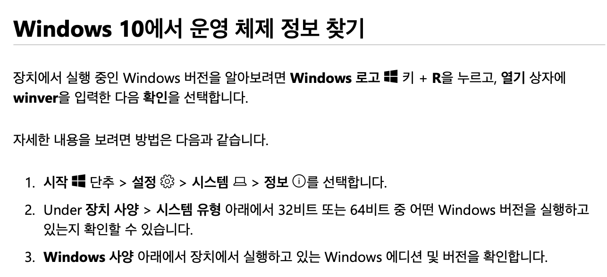

# 2주차 수업

- detail: 프로세싱 및 아두이노 설치/개발환경 소개
- 내용: 피지컬컴퓨팅 소개

---

# 프로세싱 및 아두이노 설치

## 사용하고 있는 운영체제 확인하기

사용중인 운영체제에 맞는 버전을 다운받아 설치합니다.

- windows 운영체제 정보 찾는 법
    - `윈도우탐색기` 를 연 뒤, 내PC를 우클릭한 후  `속성`을 클릭하여 확인

    또는 아래를 참고한다.

    

- macOS는 64비트 전용 운영체제입니다.
- 리눅스 운영체제에서 설치하기
    - arch linux : `sudo pacman -S processing`

## 프로세싱 설치

[http://processing.org/download/](http://processing.org/download/)

## 아두이노 설치

[https://www.arduino.cc/en/Main/Software](https://www.arduino.cc/en/Main/Software)

프로세싱과 마찬가지로 사용중인 운영제체에 맞는 버전을 다운받아 설치합니다.

---

# 훑어보기

## 프로세싱

### 에디터

코드를 직접 작성하는 공간으로, 스케치라고도 불리운다. 
저장하면 `폴더` 단위로 저장되며, 폴더 안에 `동일한 이름`의 `.pde` 확장자의 파일로 저장된다.

- 실행아이콘 : 컴파일 후 실행
- 정지 : 프로그램의 실행을 종료
- 디버깅 버튼 : 변수에 어떤 값이 들어있는지를 확인할 수 있는 디버그 도구.
- 모드 전환 : python, android, R, javascript 등의 다양한 모드를 추가하고 선택할 수 있다. 수업에서는 java버전을 중심으로 진행된다.
- 콘솔 영역 : `print()`, `println()` 명령어로 변수나 특정 메시지를 출력할 수 있는 영역. 맥의 `터미널`, PC의 `명령 프롬프트`라고 생각하면 된다.
- 에러 확인 : 코드의 에러들을 실시간으로 확인하여 알려줌
- 환경설정

    

### 캔버스

- 작성한 코드가 실행되는 실행창이다.

## 아두이노
- 아두이노는 별도로 다룬다.
---

# 개발 환경설정

## 추천 에디터 :  visual studio code

→ 다운로드 및 설치  : [https://code.visualstudio.com/download](https://code.visualstudio.com/download)

## 알려진 확장자 표시하기

- 윈도우/맥은 기본적으로 파일의 확장자를 숨긴다. 
때에따라서는 파일명이 아니라 파일명의 확장자까지 정확히 알아야 할 때가 있다.

### windows
- [윈도우 7 이상의 버전에서 확장자 보이게 하기](https://support.microsoft.com/ko-kr/help/980857)

### macOS
- [맥OS에서 확장자 보이게 하기](https://support.apple.com/ko-kr/guide/mac-help/mchlp2304/mac)
## 오프라인 도큐먼트 뷰어

프로세싱 및 아두이노에서 사용가능한 명령어 리스트 및 사용예제등은 공식 웹사이트에서 확인이 가능하지만, 매번 웹브라우저를 열지 않고 손쉽게 단축키로 명령어를 검색하는 프로그램이 있어 소개합니다. 

프로세싱/아두이노 뿐만 아니라, 현존하는 대부분의 프로그래밍 언어를 지원합니다. 

dash for mac

velocity

- **MAC OS**  
Dash for Mac → [https://kapeli.com/dash](https://kapeli.com/dash)  
다운로드 받기 → [https://www.dropbox.com/s/avpmlfexzix8f8v/Dash.zip?dl=0](https://www.dropbox.com/s/avpmlfexzix8f8v/Dash.zip?dl=0) 
맥에서 Zeal 설치하기 → [https://github.com/zealdocs/zeal/wiki/Build-Instructions-for-macOS](https://github.com/zealdocs/zeal/wiki/Build-Instructions-for-macOS)
- **Windows**  
Velocity → [https://velocity.silverlakesoftware.com](https://velocity.silverlakesoftware.com/) 
Zeal → [https://zealdocs.org](https://zealdocs.org/)

# github 소개

개발자들의 SNS와도 같은 곳으로, 코드를 저장하는 저장소인 git을 웹서비스로 제공하는 곳이다. 
무료로 가입/사용이 가능하다.

매주 수업 진행 후 실습 예제등을 이곳에 공유할 예정.

**오전반** → [https://github.com/inhaUniv-2020-01-physical-computing-001/classroom](https://github.com/inhaUniv-2020-01-physical-computing-001/classroom) 
**오후반** → [https://github.com/inhaUniv-2020-01-physical-computing-002/classroom](https://github.com/inhaUniv-2020-01-physical-computing-002/classroom)

## GIT?

리눅스를 처음 고안한 리누스 토발즈라는 개발자께서 리눅스 커널을 관리하는 버전관리시스템(SVC)이 너무 엉망이라며 투털거리면서 2주만에 뚝딱 만들어낸 버전관리 시스템.

## Github

대표적인 무료 Git 저장소로, 오픈소스(공개) 프로젝트의 경우 완전 무료, 비공개 저장소는 3명 참여까지는 무료로 사용할 수 있다. 전세계의 수많은 오픈소스 프로젝트들이 깃헙을 사용하고 있다.  

프로세싱또한 오픈소스로 개발되고 있어서, 개발코드들을 깃헙에서 직접 살펴볼 수 있으며, 버그를 발견할 경우, 해당 프로젝트 저장소에 보고할 수 있다. 

터미널에서 직접 명령어를 이용하여 깃을 사용할 수 있지만, 별도의 GUI 어플리케이션을 통해 사용할 수 있다. 

GitHub Desktop Download → [https://desktop.github.com](https://desktop.github.com/)

> 깃 쉽게 이해하기
> **누구나 쉽게 이해할 수 있는 Git 입문 →** [https://backlog.com/git-tutorial/kr/intro/intro1_1.html](https://backlog.com/git-tutorial/kr/intro/intro1_1.html) 
> **GitHub Desktop 사용** → [https://github.com/cau-cmclab/sku-cmclab.github.io/wiki/깃허브-데스크탑(GitHub-Desktop)-사용](https://github.com/cau-cmclab/sku-cmclab.github.io/wiki/깃허브-데스크탑(GitHub-Desktop)-사용)

## 로컬 에서 특정 폴더를 깃으로 버전관리하기

특정 폴더를 저장소로 만들면, 파일버전등을 관리할 수 있다. 
저장소를 만든 뒤에는, 어떠한 파일이든 새로 만들어지거나, 수정한 내역등을 기록할 수 있다.

### add/commit

- `add` : 특정 파일의 변경사항을 추가한다. (새로 만들어진 파일, 삭제된 파일 혹은 업데이트된 파일)
- `commit` : 변경사항을 기록한다
    - 파일을 추가하거나, 변경된 사항을 기록한다. 커밋을 해야 변경사항이 기록되며, 커밋할때마다 메시지를 남긴다

## 원격 저장소(깃헙)와 로컬저장소(로컬) 연동하기

### clone:

원격 저장소의 코드를 로컬에 똑같이 복제하는 명령어 
깃헙에서 코드들을 zip파일로 다운받을 수 있지만, 깃을 사용하면 손쉽게 복제가 가능하다. 
추후에 원격저장소의 코드가 업데이트 된다면, 업데이트 깃을 통해 반영할 수도 있다.

> **clone ** 
> **원격저장소** (깃헙 저장소) 
> ↓ ↓  `clone` 
> **로컬 저장소** (내 컴퓨터)

### push / pull :

등록된 원격 저장소와 로컬 저장소간에 업데이트된 코드들을 업데이트(동기화)하는 명령어이다.

> **pull `git pull` ** 
> 원격 저장소의 내용을 로컬 저장소에 반영한다. 
> —————————————————— 
>**원격 저장소** (깃헙 서버) 
> ↓ `pull`  
> **로컬 저장소** (내 컴퓨터)

> **push  `git push ORIGIN MASTER`**  
> 로컬 저장소의 내용을 원격 저장소에 반영한다. 
> **commit된 내용들만 동기화된다.* 
> —————————————————— 
> **원격 저장소** (깃헙 서버) 
> ↑ `push` 
>  **로컬 저장소** (내 컴퓨터)

## 깃헙 실습하기