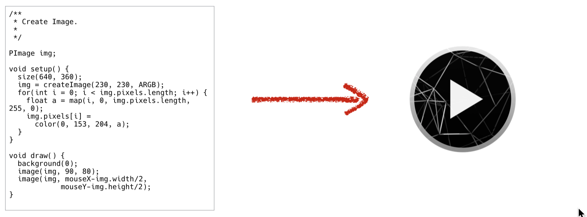

# 3주차 수업

date: Mar 31, 2020
detail: 프로세싱 설치 / 설정 / 기초도형 및 스타일 지정명령어
내용: 그래픽 프로그래밍 1

# 코드의 실행

`Command + Shift + O` 또는 `Ctrl + Shift + O` 를 눌러 예제리스트 중 하나를 더블클릭하여 열고 실행해봅시다.

## 컴파일

컴퓨터는 소스코드를 읽고 그것을 해석하여 실행가능한 기계어로 번역한 뒤, 메모리에 그 내용을 읽어들이고 실행한다.




## 프로그래밍 소스코드

소스코드는 명령어들의 집합이라고 할 수 있다.
`();` 로 끝나는 부분이 명령어 이며 이를 함수라고도 한다.
함수를 실행하는것을 `함수를 호출한다` 라고 부르기도 한다.

---

# 프로세싱 문법

코드를 작성하는것은 레고를 조립하는것과 비슷하다.
아주 단순한 부품들을 조립하여 큰 집을 만드는것과 비슷하다. 

## 명령어( aka 함수)

무언가 일을 하는 `블랙박스` 같은 개념<br/>
이 `블랙박스` 는 실제로 함수라고 불리우는데, 프로세싱에는 미리 사용할 수 있는 다양한 함수들을 제공한다.<br/>
이런 함수들을 `사용`하는 것을 `함수를 호출한다` 라고 부른다.

### 명령어의 종류

[레퍼런스 페이지](http://processing.org/reference) 에서, 프로세싱에서 사용가능한 명령어들의 리스트를 볼 수 있다.

### `;` : 세미콜론

코드를 작성할때에는 끝에 반드시 `;` 를 사용한다.<br/>
코드를 처음 접할때, 가장 흔하게 하는 실수가 세미콜론을 빼먹는 것이다.

### 파라메터 (매개변수)

명령어의 종류에 따라 전달해야할 값의 개수가 다르다.

## 주석처리

컴퓨터가 읽지 않고 작성한 사람만 읽을 수 있는 영역이 있다.
이를 주석 (comment)라고 한다.<br/>
프로그램 언어마다 다르게 표기하지만, 프로세싱에서는 `//` 를 사용한다.<br/>
여러 줄을 한번에 주석처리 하고 싶으면 `/*` 와, `*/` 로 감싼다.

`*` 는 컴퓨터에서 `모든것` 을 의미한다.

프로세싱에서는 `command + /` 또는 `ctrl+/` 단축키를 사용하여 주석처리를 하거나 역으로 해제할 수 있다.

---

# Drawing by Numbers

이번 챕터에서는 캔버스의 기본 환경을 설정하는 명령어들을 살펴본다.

## 캔버스의 기본 설정

### 캔버스의 사이즈 지정

캔버스(실행창)의 크기는 `size()` 명령을 통해 지정할 수 있다.
별도 지정이 없을경우, `100 x 100px`  크기를 갖는다.
```
size(가로, 세로);       // 켄버스의 가로 및 세로 크기를 px 단위로 지정한다.
```
### 3D모드 설정

`size()` 명령을 사용하여, 캔버스를 3D모드로 그릴지 말지도 설정할 수도 있다.
```
size(400, 400);       // 별도 지정이 없을시에는 2D모드이다.
size(400, 400, P3D);  // 3D모드로 그린다.
```
### 픽셀 밀도 설정(옵션)

`pixelDensity()` 명령어를 통해, 고해상도 디스플레이를 지원할수 있도록 할 수 있다.<br/>
맥에서는 `레티나 디스플레이`, 윈도우에서는 `highDPI`라고 불리기도하며, 고급 노트북이나 모니터에서 지원하기도 한다. <br/>
반드시 `size()` 명령 뒤에 작성해야 한다고 명시하고 있다.

```
size(가로크기, 세로크기);
pixelDensity(2);      // 고해상도로 출력 
```
## 프로세싱의 좌표계

### 좌표의 원점

프로세싱의 좌표는 좌측 상단을 원점으로 한다.<br/>
3D의 경우, 화면에서 자신을 바라보는 방향이  z축의 + 방향이다.

## 기초 도형 그리기

### 2D Primitive

- 점 : `point(x, y)`
    - 점의 x, y, 좌표
- 라인 : `line(x1, y1, x2, y2)`
    - 라인의 시작점 좌표 `x1, y1` 와 끝점의 좌표 `x2, y2`
- 삼각형 : `triangle(x1, y1, x2, y2, x3, y3)`
    - 삼각형의 세 꼭짓점 `x1, y1` , `x2, y2` , `x3, y3`
- 사각형 : `quad(x1, y1, x2, y2, x3, y3, x4, y4)`
    - 사각형의 네 꼭지점 `x1, y1` , `x2, y2` , `x3, y3`, `x4, y4`
- 직사각형 : `rect(x, y, w, h)`
    - 직사각형의 경우 제 변이 서로 직각이므로, `quad()`와 다르게 8개의 입력값이 아니라 4개의 입력값만으로도 그려낼 수 있다.
    - 사각형의 기준점은 `좌측 상단` 이다.
    - `x, y` : 직사각형의 좌측상단 꼭지점의 좌표
    - `w, h` : 직사각형의 가로 및 세로의 크기
- 타원 : `ellipse(x, y, w, h)`
    - `x, y` : 원의 중심점의 좌표
    - `w, h` : 타원의 가로, 세로의 크기 (w와 h가 같으면 원이 된다)
- 호(arc) : `arc(a, b, c, d, start, end, mode)`
    - `a, b` : 호의 기본이 되는 원의 중심좌표
    - `c, d` : 호의 기본이 되는 원의 가로, 세로
    - `start, end` : 호의 중심으로부터의 시작각도와 끝점의 각도. 라디안 단위로 명시해야한다.
        - 0도, 90도와 같은 각의 단위는 degree이며, 이를 호도법인 radians로 변환해줘야한다.
        - 프로세싱에서는 `radians()`라는, degree를 radians단위로 변환해주는 함수를 제공한다.

            즉 90도를 라디안으로 변환하려면 `radians(90)` 로 입력하면 된다.

    - `mode` : `OPEN`(열리기), `CHORD`(닫기), `PIE`(파이) 로 그리기

## 스타일 지정하기

스타일을 한번 지정하면, 이후 지정된 스타일대로 그려진다.

### 도형의 원점 모드 변경

- `ellipseMode(MODE)`
    - ellipse는 기본적으로 `CENTER`모드이다.
    - `MODE`
        - `CENTER` - 중심을 기준으로 한다.
        - `CORNER` - 좌측 상단을 기준으로 한다
- `rectMode(MODE)`
    - rect는 기본적으로 `CORNER`모드이다.
    - `MODE`
        - `CENTER` - 중심을 기준으로 한다.
        - `CORNER` - 좌측 상단을 기준으로 한다

### 채우기 및 라인 설정

- `fill(c)`  : 지정한 색으로 채운다
    - `c` : 색
        - 0-255 의 범위를 갖는 하나의 값으로 밝기를 지정한다(
        - 0-255, 0-255, 0-255의 범위를 갖는 `r, g, b` 세 값으로 컬러를 지정할 수 있다.
        - 메뉴의 `도구(tool) / color picker` 를 사용하여 16진수 `HEX` 값을 복사하여 사용할 수 있다.
- `noFill()` : 색을 채우지 않는다.
- `stroke(c)` : 지정한 색으로 외곽선 그린다.
    - `c` : 색
        - 0-255 의 범위를 갖는 하나의 값으로 밝기를 지정한다(
        - 0-255, 0-255, 0-255의 범위를 갖는 `r, g, b` 세 값으로 컬러를 지정할 수 있다.
        - 메뉴의 `도구(tool) / color picker` 를 사용하여 16진수 `HEX` 값을 복사하여 사용할 수 있다.
- `noStroke()` : 외곽선을 그리지 않는다.
- `strokeWeight(n)` : 외곽선의 두께를 지정한다.
    - n : 외곽선의 두께 (픽셀단위)